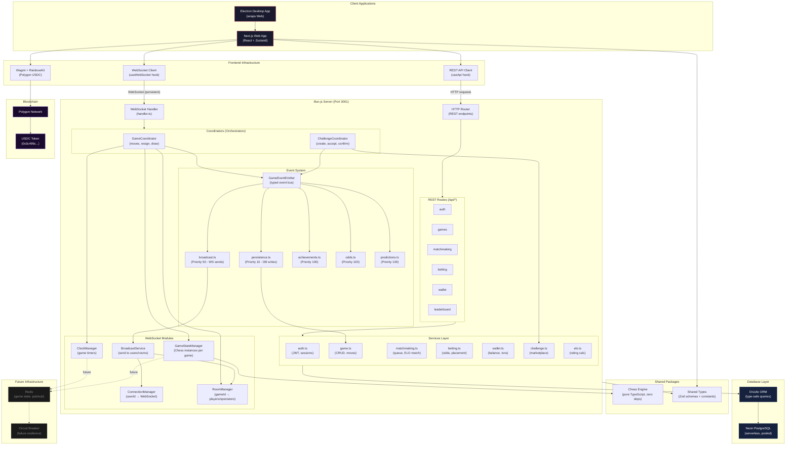

# Holistic System Architecture

The complete chess game system — how every major component connects.

```mermaid
graph TB
    subgraph Clients["Client Applications"]
        Web["Next.js Web App<br/>(React + Zustand)"]
        Desktop["Electron Desktop App<br/>(wraps Web)"]
    end

    subgraph Frontend_Infra["Frontend Infrastructure"]
        Wagmi["Wagmi + RainbowKit<br/>(Polygon USDC)"]
        WSClient["WebSocket Client<br/>(useWebSocket hook)"]
        REST["REST API Client<br/>(useApi hook)"]
    end

    subgraph Shared["Shared Packages"]
        ChessEngine["Chess Engine<br/>(pure TypeScript, zero deps)"]
        SharedTypes["Shared Types<br/>(Zod schemas + constants)"]
    end

    subgraph Server["Bun.js Server (Port 3001)"]
        HTTP["HTTP Router<br/>(REST endpoints)"]
        WS["WebSocket Handler<br/>(handler.ts)"]

        subgraph Coordinators["Coordinators (Orchestrators)"]
            GameCoord["GameCoordinator<br/>(moves, resign, draw)"]
            ChallengeCoord["ChallengeCoordinator<br/>(create, accept, confirm)"]
        end

        subgraph WSModules["WebSocket Modules"]
            ConnMgr["ConnectionManager<br/>(userId → WebSocket)"]
            RoomMgr["RoomManager<br/>(gameId → players/spectators)"]
            Broadcast["BroadcastService<br/>(send to users/rooms)"]
            ClockMgr["ClockManager<br/>(game timers)"]
            GameState["GameStateManager<br/>(Chess instances per game)"]
        end

        subgraph Events["Event System"]
            Emitter["GameEventEmitter<br/>(typed event bus)"]
            Persistence["persistence.ts<br/>(Priority 10 - DB writes)"]
            BroadcastH["broadcast.ts<br/>(Priority 50 - WS sends)"]
            Achievements["achievements.ts<br/>(Priority 100)"]
            Odds["odds.ts<br/>(Priority 100)"]
            Predictions["predictions.ts<br/>(Priority 100)"]
        end

        subgraph Services["Services Layer"]
            AuthSvc["auth.ts<br/>(JWT, sessions)"]
            GameSvc["game.ts<br/>(CRUD, moves)"]
            MatchSvc["matchmaking.ts<br/>(queue, ELO match)"]
            BetSvc["betting.ts<br/>(odds, placement)"]
            WalletSvc["wallet.ts<br/>(balance, txns)"]
            ChallengeSvc["challenge.ts<br/>(marketplace)"]
            EloSvc["elo.ts<br/>(rating calc)"]
        end

        subgraph Routes["REST Routes (/api/*)"]
            AuthRoute["auth"]
            GamesRoute["games"]
            MatchRoute["matchmaking"]
            BetRoute["betting"]
            WalletRoute["wallet"]
            LeaderRoute["leaderboard"]
        end
    end

    subgraph Database["Database Layer"]
        Drizzle["Drizzle ORM<br/>(type-safe queries)"]
        Neon["Neon PostgreSQL<br/>(serverless, pooled)"]
    end

    subgraph Future["Future Infrastructure"]
        Redis["Redis<br/>(game state, pub/sub)"]
        CircuitBreaker["Circuit Breaker<br/>(failure resilience)"]
    end

    subgraph Blockchain["Blockchain"]
        Polygon["Polygon Network"]
        USDC["USDC Token<br/>(0x3c499c...)"]
    end

    %% Client connections
    Web --> WSClient
    Web --> REST
    Web --> Wagmi
    Desktop --> Web

    %% Frontend to Server
    WSClient -->|"WebSocket (persistent)"| WS
    REST -->|"HTTP requests"| HTTP

    %% Server routing
    HTTP --> Routes
    WS --> Coordinators

    %% Coordinators use modules
    GameCoord --> GameState
    GameCoord --> ClockMgr
    GameCoord --> RoomMgr
    GameCoord --> Emitter
    ChallengeCoord --> ChallengeSvc
    ChallengeCoord --> Emitter

    %% Event handlers
    Emitter --> Persistence
    Emitter --> BroadcastH
    Emitter --> Achievements
    Emitter --> Odds
    Emitter --> Predictions

    %% Broadcast uses WS modules
    BroadcastH --> Broadcast
    Broadcast --> ConnMgr
    Broadcast --> RoomMgr

    %% Routes use services
    Routes --> Services

    %% Services use DB
    Services --> Drizzle
    Persistence --> GameSvc
    Drizzle --> Neon

    %% Shared packages
    GameState --> ChessEngine
    Web --> SharedTypes
    Server --> SharedTypes

    %% Blockchain
    Wagmi --> Polygon
    Polygon --> USDC

    %% Future
    ClockMgr -.->|"future"| Redis
    GameState -.->|"future"| Redis
    Redis -.-> CircuitBreaker

    %% Styling
    classDef client fill:#1a1a2e,stroke:#e94560,color:#fff
    classDef server fill:#0a0a0a,stroke:#4ecdc4,color:#fff
    classDef db fill:#16213e,stroke:#0f3460,color:#fff
    classDef future fill:#1a1a1a,stroke:#666,color:#888,stroke-dasharray: 5 5
    classDef blockchain fill:#1a0a2e,stroke:#8b5cf6,color:#fff

    class Web,Desktop client
    class Neon,Drizzle db
    class Redis,CircuitBreaker future
    class Polygon,USDC blockchain
```
