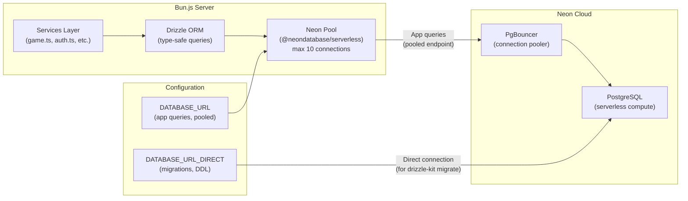
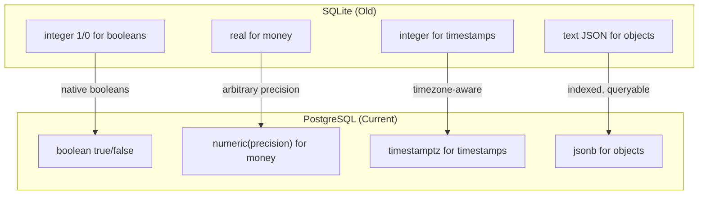

# Database Layer Architecture

How the application talks to Neon PostgreSQL via Drizzle ORM.

## Connection Architecture



## Schema Entity Relationships

```mermaid
erDiagram
    users ||--o{ games : "plays as white"
    users ||--o{ games : "plays as black"
    users ||--o{ bets : "places"
    users ||--o{ transactions : "has"
    users ||--o{ sessions : "has"
    users ||--o{ userAchievements : "earns"
    users ||--o{ challenges : "creates"
    users ||--o{ spectatorPredictions : "creates"
    users ||--o{ spectatorChat : "sends"
    users ||--o{ matchmakingQueue : "joins"

    games ||--o{ bets : "receives"
    games ||--o{ spectatorPredictions : "receives"
    games ||--o{ spectatorChat : "has"

    users {
        text id PK "nanoid"
        text email UK
        text username UK
        text password_hash "nullable (OAuth)"
        text google_id UK "Google OAuth"
        text github_id UK "GitHub OAuth"
        integer elo_rating "default 1200"
        integer peak_elo_rating "default 1200"
        integer games_played "default 0"
        integer games_won "default 0"
        integer games_lost "default 0"
        integer games_drawn "default 0"
        numeric balance "USDC, default 0"
        timestamptz created_at
    }

    games {
        text id PK "nanoid"
        text white_player_id FK
        text black_player_id FK
        text status "waiting|active|completed"
        text result "white_wins|black_wins|draw"
        text winner_id FK
        text current_fen
        jsonb moves "array of moves"
        text pgn
        numeric stake_amount "USDC per player"
        jsonb time_control "{initial, increment}"
        integer white_time_remaining "ms"
        integer black_time_remaining "ms"
        integer white_elo_change
        integer black_elo_change
        timestamptz started_at
        timestamptz ended_at
        timestamptz created_at
    }

    bets {
        text id PK
        text user_id FK
        text game_id FK
        text predicted_winner_id FK
        numeric amount "USDC"
        numeric odds "decimal"
        text status "pending|won|lost|refunded"
        numeric payout "if won"
        timestamptz created_at
    }

    transactions {
        text id PK
        text user_id FK
        text type "deposit|withdrawal|bet|winnings|stake|refund"
        numeric amount "signed"
        numeric balance_after
        text reference_id "game/bet id"
        text description
        timestamptz created_at
    }

    challenges {
        text id PK
        text creator_id FK
        text opponent_id FK "nullable until accepted"
        numeric stake_amount
        jsonb time_control
        text status "open|accepted|confirmed|cancelled|expired"
        integer min_elo "filter"
        integer max_elo "filter"
        boolean creator_confirmed "default false"
        boolean opponent_confirmed "default false"
        timestamptz created_at
        timestamptz expires_at
    }

    matchmakingQueue {
        text id PK
        text user_id FK UK
        numeric stake_amount
        jsonb time_control
        integer user_elo
        integer min_elo "filter"
        integer max_elo "filter"
        timestamptz joined_at
    }

    spectatorPredictions {
        text id PK
        text game_id FK
        text creator_id FK
        text matcher_id FK "nullable"
        text predicted_winner "white|black"
        numeric amount
        boolean is_matched "default false"
        text status "open|matched|won|lost|cancelled"
        timestamptz created_at
    }

    spectatorChat {
        text id PK
        text game_id FK
        text user_id FK
        text message
        timestamptz created_at
    }

    sessions {
        text id PK
        text user_id FK
        text token_hash
        text ip_address
        text user_agent
        boolean is_valid "default true"
        timestamptz created_at
        timestamptz expires_at
    }

    userAchievements {
        text id PK
        text user_id FK
        text achievement_id
        timestamptz unlocked_at
    }

    featureFlags {
        text id PK
        text flag_name UK
        boolean enabled "default false"
        text description
        timestamptz created_at
    }
```

## Data Type Decisions (SQLite → PostgreSQL)


