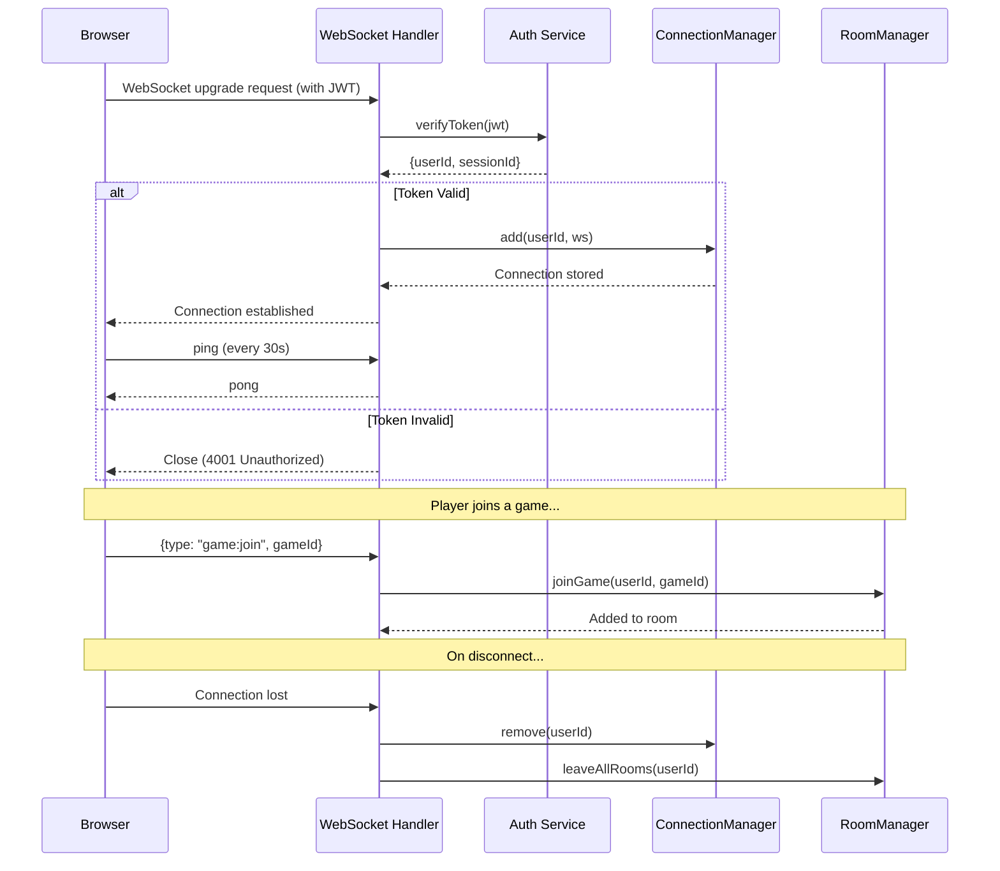
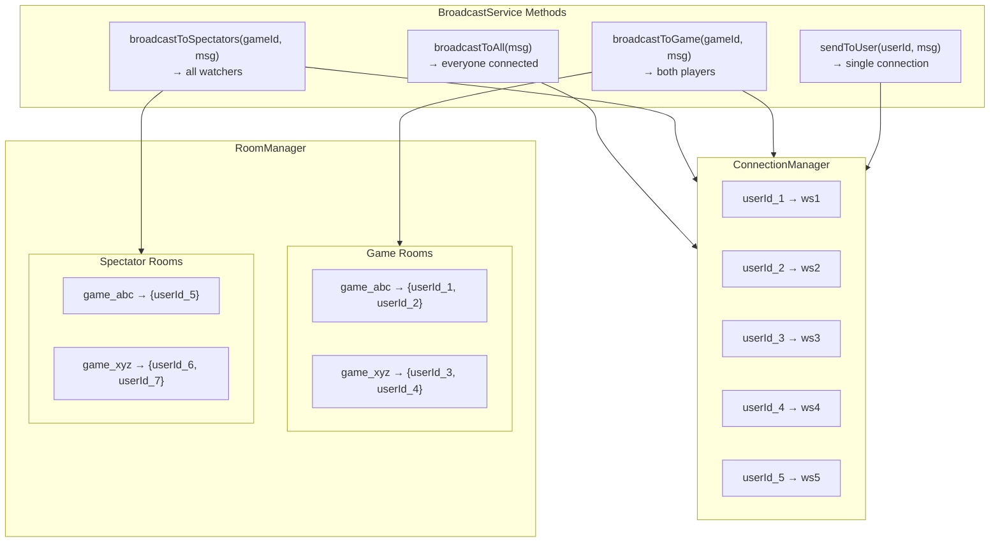
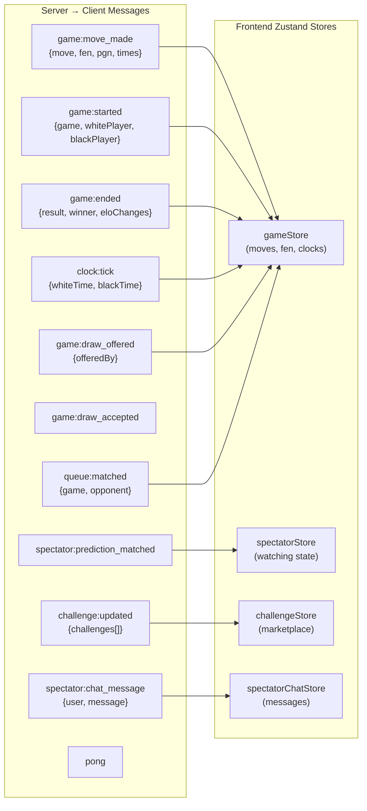
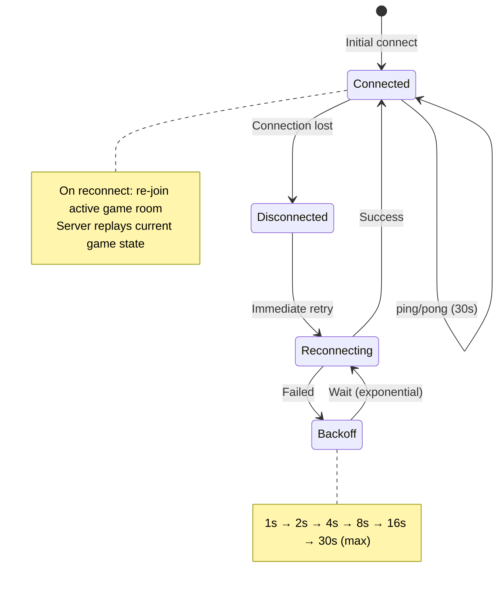

# WebSocket & Real-Time Architecture

How persistent connections enable instant game updates.

## Connection Lifecycle

## Room & Connection Architecture

## Message Types & Routing

```mermaid
graph LR
    subgraph ClientMessages["Client → Server Messages"]
        GM["game:move<br/>{from, to, promotion?}"]
        GJ["game:join<br/>{gameId}"]
        GR["game:resign<br/>{gameId}"]
        GD["game:offer_draw<br/>{gameId}"]
        GA["game:accept_draw<br/>{gameId}"]
        QJ["queue:join<br/>{stakeAmount, timeControl}"]
        QL["queue:leave"]
        SJ["spectate:join<br/>{gameId}"]
        CC["challenge:create<br/>{stake, timeControl, elo}"]
        CA["challenge:accept<br/>{challengeId}"]
        CF["challenge:confirm<br/>{challengeId}"]
        CS["spectator:chat_send<br/>{gameId, message}"]
        CP["spectator:prediction_create<br/>{gameId, winner, amount}"]
        PING["ping"]
    end

    subgraph Router["handler.ts<br/>(Message Router)"]
        Route["Switch on<br/>message.type"]
    end

    subgraph Handlers["Coordinators"]
        GameCoord["GameCoordinator"]
        ChallengeCoord["ChallengeCoordinator"]
    end

    ClientMessages --> Route
    Route -->|"game:*"| GameCoord
    Route -->|"queue:*"| GameCoord
    Route -->|"spectate:*"| GameCoord
    Route -->|"spectator:*"| GameCoord
    Route -->|"challenge:*"| ChallengeCoord
```

## Server → Client Messages

## Reconnection Strategy

