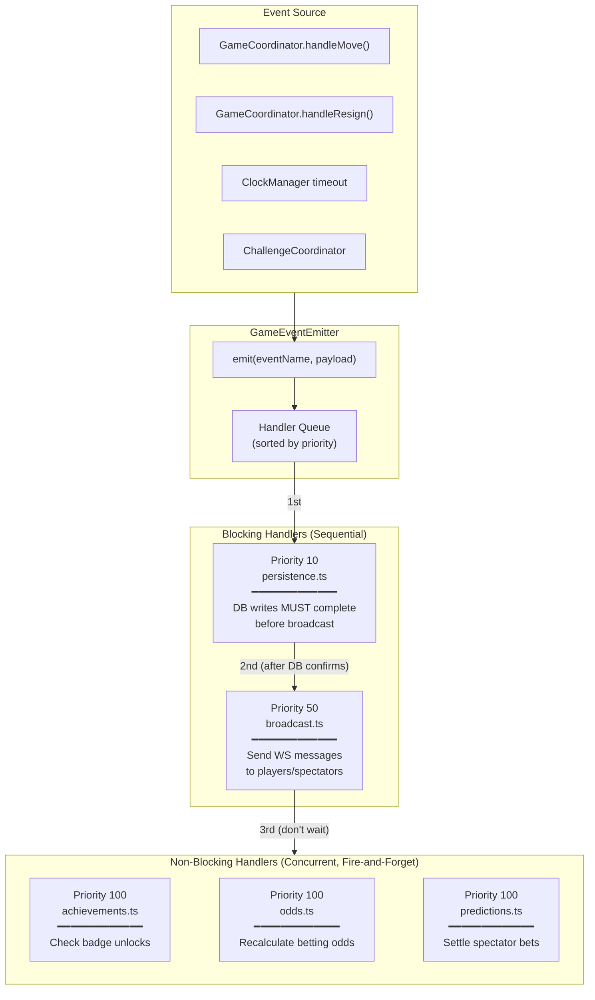
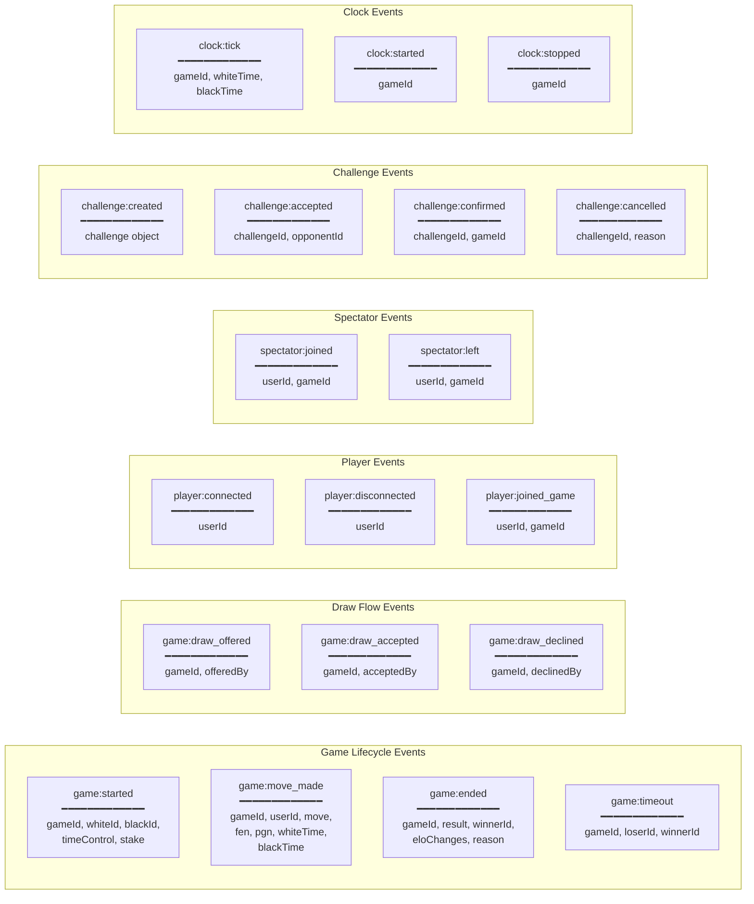
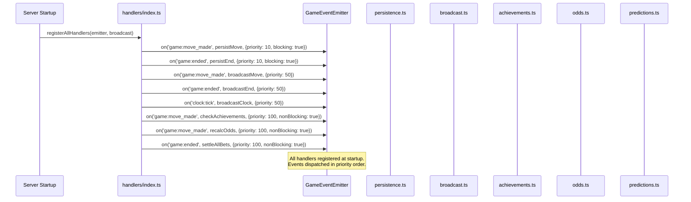
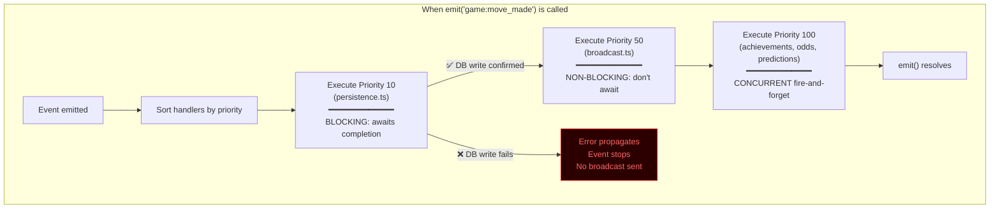

# Event System Architecture

How game actions trigger side effects through an event-driven pipeline.

## Event Flow Overview

## Event Types & Payloads

## Handler Registration

## Priority Execution Model

