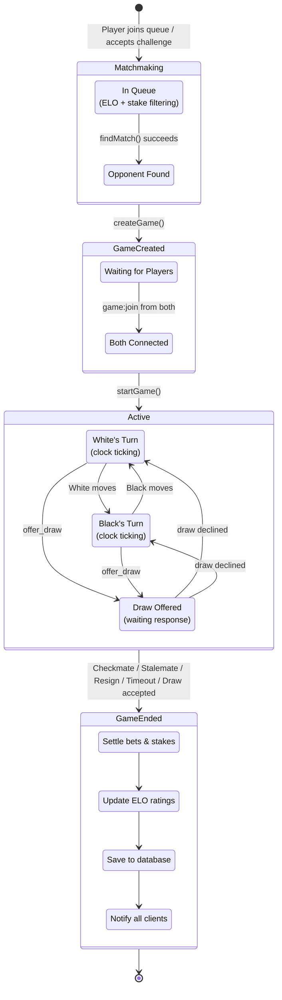
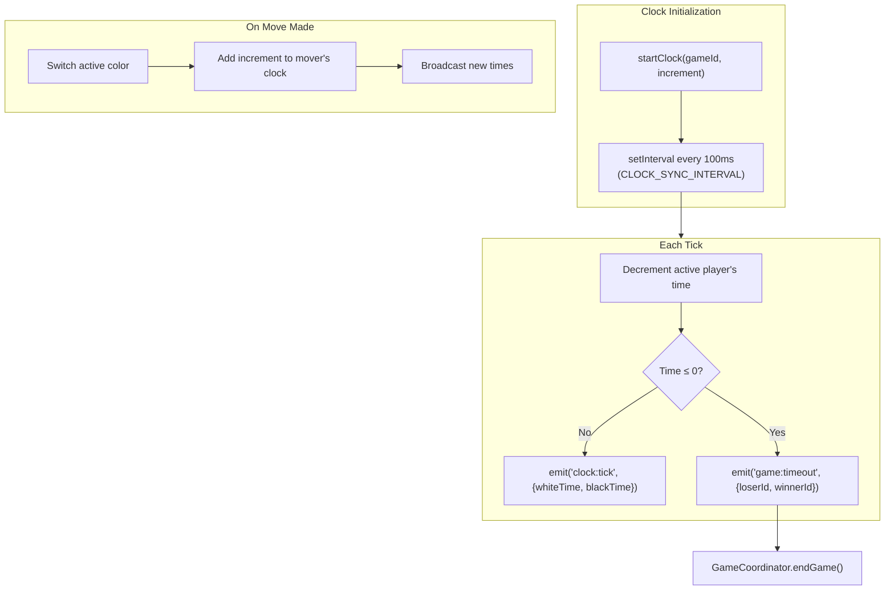
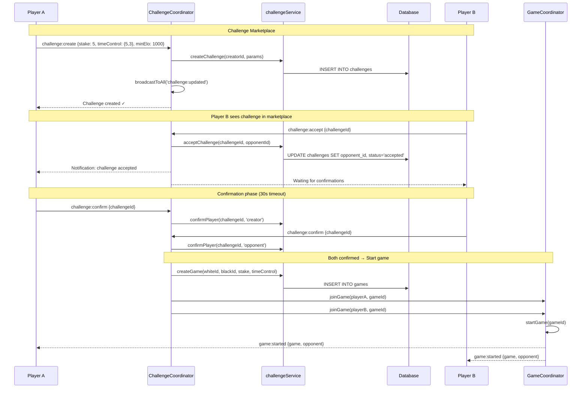

# Game Flow Architecture

Complete lifecycle of a chess game — from matchmaking to game end.

## Full Game Lifecycle

## Move Round-Trip (Complete Data Flow)

```mermaid
sequenceDiagram
    participant UI as ChessBoard (React)
    participant Store as gameStore (Zustand)
    participant WS as useWebSocket
    participant Handler as handler.ts
    participant Coord as GameCoordinator
    participant State as GameStateManager
    participant Clock as ClockManager
    participant Events as GameEventEmitter
    participant DB as persistence.ts
    participant Bcast as broadcast.ts
    participant P2 as Player 2 WS

    UI->>Store: User clicks piece & square
    Store->>WS: send('game:move', {from: 'e2', to: 'e4'})
    WS->>Handler: WebSocket message received

    Handler->>Coord: handleMove(userId, {gameId, from, to})

    rect rgb(30, 30, 50)
        Note over Coord,State: Validation Phase
        Coord->>State: validateAndApplyMove(gameId, from, to)
        State->>State: Chess engine validates legality
        State-->>Coord: {move, fen, pgn, isGameOver, isCheckmate...}
    end

    alt Move is illegal
        Coord-->>Handler: Error: illegal move
        Handler-->>WS: send('error', {message})
        WS-->>UI: Show error toast
    else Move is legal
        rect rgb(30, 50, 30)
            Note over Coord,Clock: Clock Update
            Coord->>Clock: switchTurn(gameId, increment)
            Clock-->>Coord: {whiteTime, blackTime}
        end

        rect rgb(50, 30, 30)
            Note over Coord,Events: Event Emission
            Coord->>Events: emit('game:move_made', {move, fen, pgn, times...})
        end

        rect rgb(20, 20, 40)
            Note over Events,DB: Priority 10 (Blocking)
            Events->>DB: gameService.makeMove(gameId, move, fen, pgn, times)
            DB-->>Events: ✅ Saved
        end

        rect rgb(20, 40, 40)
            Note over Events,P2: Priority 50 (Broadcast)
            Events->>Bcast: broadcastToGame(gameId, 'game:move_made', data)
            Bcast->>WS: send to Player 1
            Bcast->>P2: send to Player 2
            Events->>Bcast: broadcastToSpectators(gameId, 'game:move_made', data)
        end

        WS-->>Store: Update game state
        Store-->>UI: Re-render board with new position
        P2-->>P2: Update opponent's board
    end
```

## Clock System

## Challenge → Game Flow

