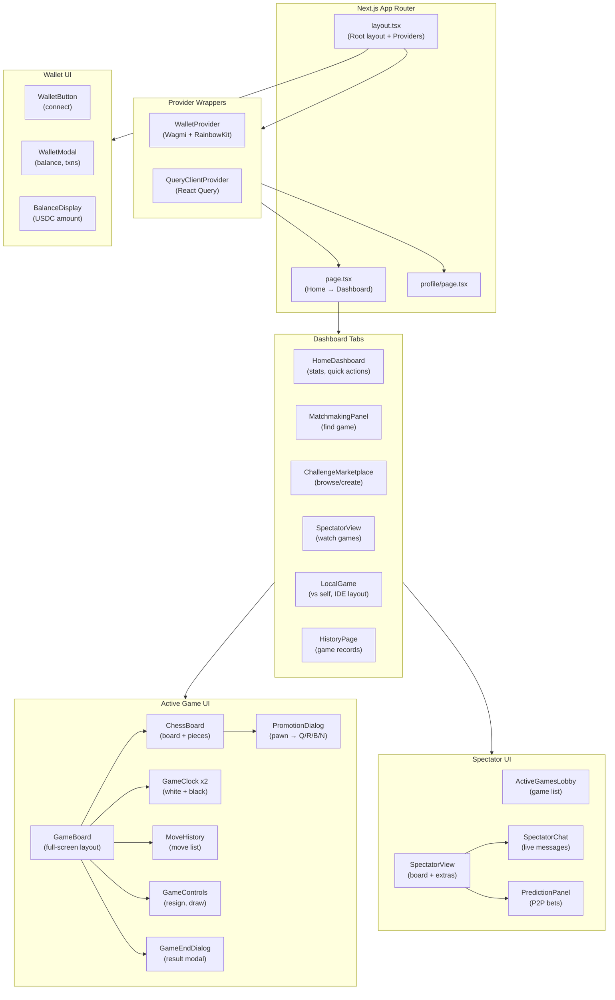
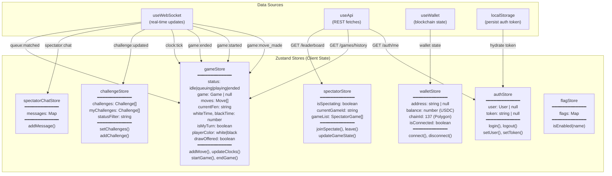
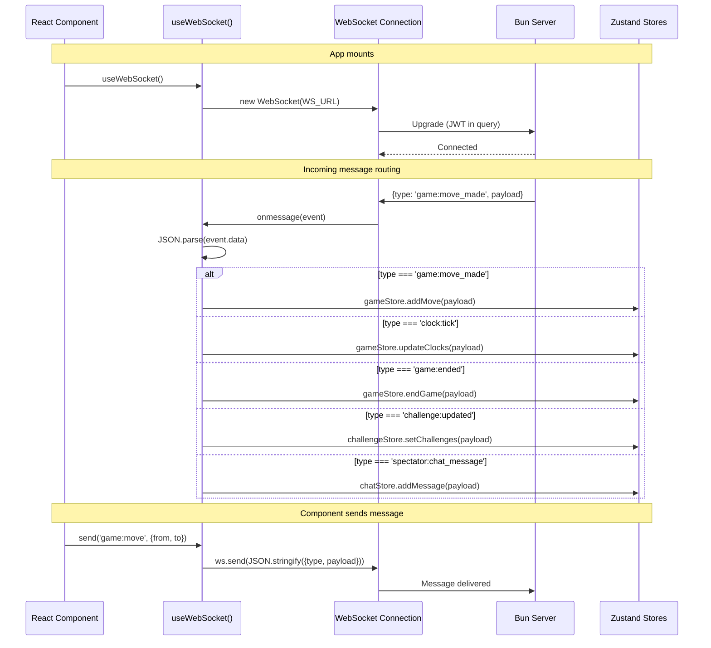
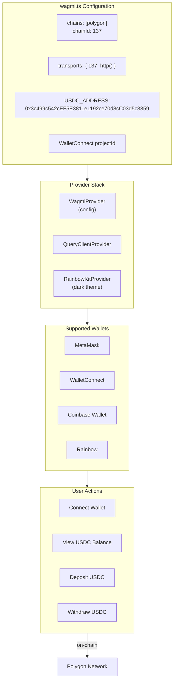

# Frontend Architecture

Next.js app with Zustand state management and WebSocket real-time updates.

## Component Hierarchy

## State Management (Zustand Stores)

## WebSocket Hook Architecture

## Wallet Integration (Polygon USDC)

