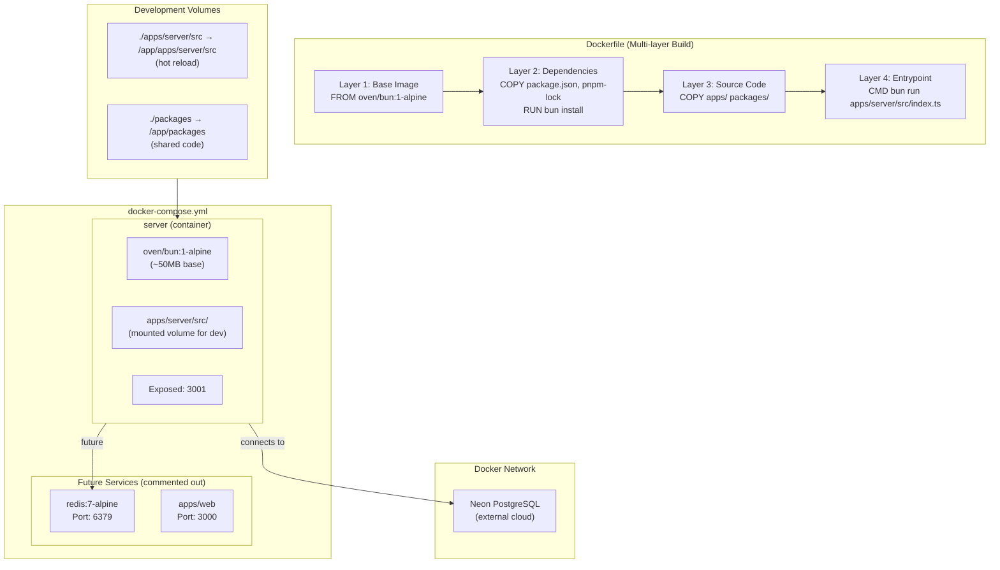
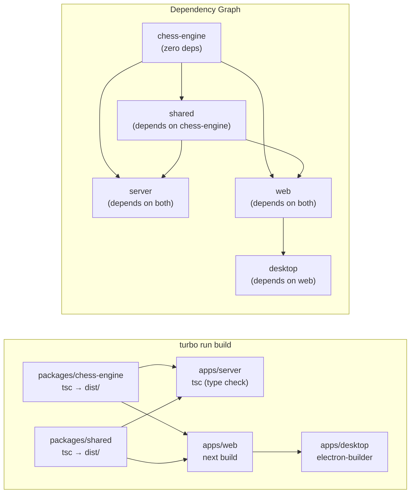
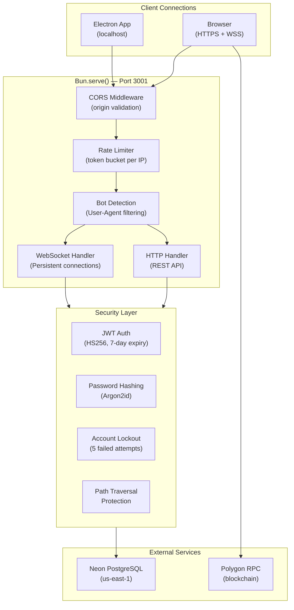
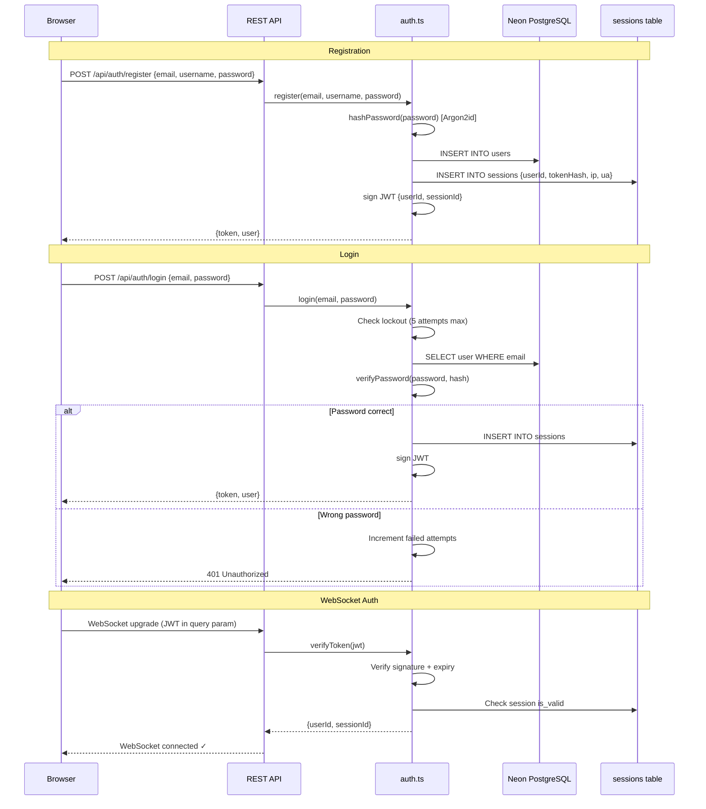

# Infrastructure & Deployment Architecture

Monorepo structure, Docker setup, and build pipeline.

## Monorepo Structure

```mermaid
graph TD
    subgraph Root["Root (Turborepo + pnpm workspaces)"]
        Turbo["turbo.json<br/>(task orchestration)"]
        PNPM["pnpm-workspace.yaml<br/>(workspace definitions)"]
        Docker["Dockerfile + docker-compose.yml"]
    end

    subgraph Apps["apps/ (Deployable Applications)"]
        Server["apps/server/<br/>━━━━━━━━━━━━━<br/>Bun.js HTTP + WebSocket<br/>Port 3001<br/>━━━━━━━━━━━━━<br/>drizzle/ events/ websocket/<br/>services/ routes/ redis/"]

        Web["apps/web/<br/>━━━━━━━━━━━━━<br/>Next.js 16 (React)<br/>Port 3000<br/>━━━━━━━━━━━━━<br/>components/ hooks/<br/>store/ config/"]

        Desktop["apps/desktop/<br/>━━━━━━━━━━━━━<br/>Electron wrapper<br/>━━━━━━━━━━━━━<br/>Loads localhost:3000<br/>Deep links, secure storage"]
    end

    subgraph Packages["packages/ (Shared Libraries)"]
        Engine["packages/chess-engine/<br/>━━━━━━━━━━━━━<br/>Pure TypeScript chess rules<br/>Zero external deps<br/>━━━━━━━━━━━━━<br/>ChessEngine class"]

        Shared["packages/shared/<br/>━━━━━━━━━━━━━<br/>Types, constants, utils<br/>Zod schemas<br/>━━━━━━━━━━━━━<br/>WSMessage types, ranks,<br/>achievements, time controls"]
    end

    Root --> Apps
    Root --> Packages

    Server -->|"imports"| Engine
    Server -->|"imports"| Shared
    Web -->|"imports"| Shared
    Web -->|"imports"| Engine
    Desktop -->|"loads"| Web

    style Engine fill:#1a2a1a,stroke:#4ecdc4
    style Shared fill:#1a2a1a,stroke:#4ecdc4
```

## Docker Architecture

## Build Pipeline (Turbo)

## Server Network Architecture

## Authentication Flow

