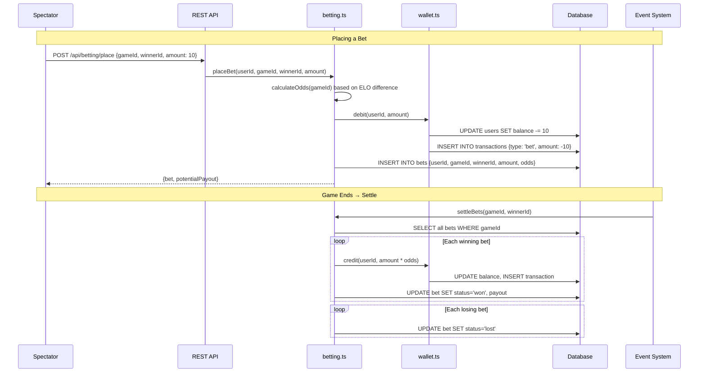
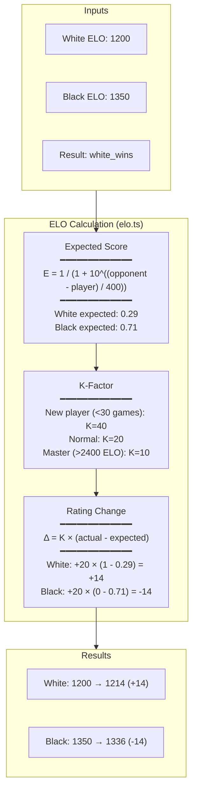
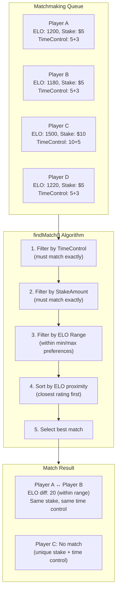

# Services Layer Architecture

Business logic layer between coordinators/routes and the database.

## Service Dependencies

```mermaid
graph TD
    subgraph Callers["Who Calls Services"]
        Routes["REST Routes<br/>(HTTP endpoints)"]
        Coords["Coordinators<br/>(Game, Challenge)"]
        EventH["Event Handlers<br/>(persistence, odds)"]
    end

    subgraph Services["Services Layer"]
        AuthSvc["auth.ts<br/>━━━━━━━━━━━━━<br/>register(), login()<br/>generateToken()<br/>verifyToken()<br/>hashPassword()"]

        GameSvc["game.ts<br/>━━━━━━━━━━━━━<br/>getGame(), startGame()<br/>makeMove(), endGame()<br/>getGameWithPlayers()"]

        MatchSvc["matchmaking.ts<br/>━━━━━━━━━━━━━<br/>joinQueue()<br/>leaveQueue()<br/>findMatch()<br/>createGame()"]

        BetSvc["betting.ts<br/>━━━━━━━━━━━━━<br/>calculateOdds()<br/>placeBet()<br/>settleBets()<br/>refundBets()"]

        WalletSvc["wallet.ts<br/>━━━━━━━━━━━━━<br/>getBalance()<br/>credit(), debit()<br/>getTransactions()"]

        ChallengeSvc["challenge.ts<br/>━━━━━━━━━━━━━<br/>createChallenge()<br/>acceptChallenge()<br/>confirmPlayer()<br/>cancelChallenge()"]

        EloSvc["elo.ts<br/>━━━━━━━━━━━━━<br/>calculateEloChange()<br/>(K-factor, expected score)"]

        AchieveSvc["achievements.ts<br/>━━━━━━━━━━━━━<br/>checkAndUnlock()<br/>getUserAchievements()"]

        SpectChatSvc["spectatorChat.ts<br/>━━━━━━━━━━━━━<br/>saveMessage()<br/>getMessages()"]

        SpectPredSvc["spectatorPrediction.ts<br/>━━━━━━━━━━━━━<br/>createPrediction()<br/>matchPrediction()<br/>settlePredictions()"]

        FlagSvc["featureFlags.ts<br/>━━━━━━━━━━━━━<br/>getFlag()<br/>setFlag()<br/>getAllFlags()"]

        RateSvc["rateLimit.ts<br/>━━━━━━━━━━━━━<br/>checkLimit()<br/>(token bucket algorithm)"]

        SecuritySvc["security.ts<br/>━━━━━━━━━━━━━<br/>validateOrigin()<br/>detectBot()<br/>sanitizeInput()"]

        LockoutSvc["accountLockout.ts<br/>━━━━━━━━━━━━━<br/>checkLockout()<br/>recordFailure()<br/>resetAttempts()"]
    end

    subgraph DB["Database (Drizzle ORM)"]
        DrizzleDB["db instance<br/>(Neon Pool)"]
    end

    Routes --> AuthSvc
    Routes --> GameSvc
    Routes --> WalletSvc
    Routes --> BetSvc
    Routes --> FlagSvc

    Coords --> GameSvc
    Coords --> MatchSvc
    Coords --> ChallengeSvc
    Coords --> SpectChatSvc
    Coords --> SpectPredSvc

    EventH --> GameSvc
    EventH --> BetSvc
    EventH --> AchieveSvc
    EventH --> SpectPredSvc
    EventH --> EloSvc

    AuthSvc --> LockoutSvc

    GameSvc --> EloSvc
    GameSvc --> WalletSvc

    BetSvc --> WalletSvc

    Services --> DrizzleDB
```

## Betting & Odds Flow

## ELO Rating Calculation

## Matchmaking Algorithm

